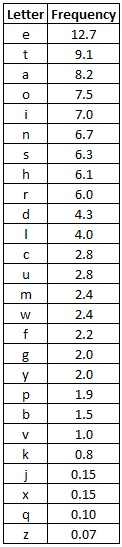
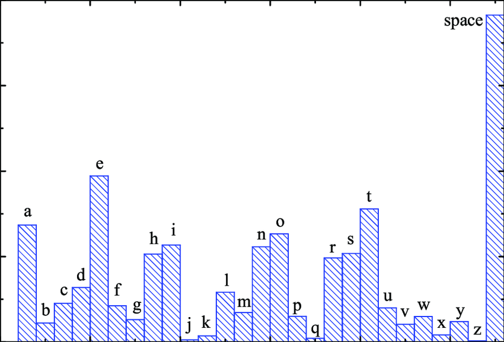
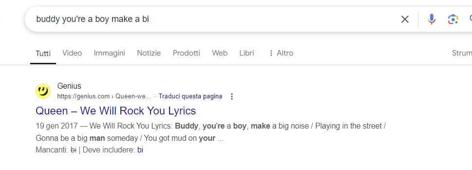

# Cybersecurity: Homework 1
#### Author: Valerio Tonelli

Frequency analysis represents a method used in cryptography to decrypt a text previously encoded through a substitution cipher.
It consists in the analysis of the occurence of each letter in the ciphertext by comparing the letter frequencies of the ciphered message with the ones of any piece of text. In the English language for example, the most common letters are  in order: E,T,A,O,I. The full frequency list is represented in this table:

In addition to this table we must consider the `space` character which is the most frequent one (more frequent then E too).

This means that given ciphertext, the letter with the highest frequency, if it is a lot greater then the others, is likely to correspond to a `space` in the plain text.
Obviously in most cases, it is not enough to swap the letters by comparing their distribution with that of the letters in the English language.
Frequency analysis relies so much on the intricacy of the language; because of that, it is almost impossible for a computer to do the whole job automatically. For this reason human input is needed in choosing which letter should replace another one.

We are going to use the frequence analysis for monogram, bi-grams,tri-grams and quad-grams dividend in different steps.The ciphered message is: 
```
PIFFMKMQI'YRKJKPQMKDJ RKJKPXAKZQXVRKNGJMXZ'KXZKTHRKVTYRRTKAQZZJKPRKJKPXAKDJZKVQDRKFJMKMQIKAQTKDIFKQZKMQ'KSJORKMQIKPXAKFXVAYJORK XO XZ'KMQIYKOJZKJGGKQLRYKTHRKNGJORKVXZAXZ'
```

For simplicity, we replaced the `space` of the cipheretext with the `_`
So the resulting text is: 
```
PIFFMKMQI'YRKJKPQMKDJ_RKJKPXAKZQXVRKNGJMXZ'KXZKTHRKVTYRRTKAQZZJKPRKJKPXAKDJZKVQDRKFJMKMQIKAQTKDIFKQZKMQ'KSJORKMQIKPXAKFXVAYJORK_XO_XZ'KMQIYKOJZKJGGKQLRYKTHRKNGJORKVXZAXZ'
```
We will refer to the ciphertext alphabet using **UPPERCASE** letters, while we'll use **lowercase** for plain text letters.
#### Step 1: Calculate the ciphertext letters distribution

```
[
  [ 'K', 20.588235294117645 ],
  [ 'R', 7.647058823529412 ],
  [ 'J', 7.647058823529412 ],
  [ 'Q', 7.0588235294117645 ],
  [ 'X', 6.470588235294119 ],
  [ 'Z', 6.470588235294119 ],
  [ 'M', 5.294117647058823 ],
  [ 'A', 4.117647058823529 ],
  [ 'P', 3.5294117647058822 ],
  [ 'I', 3.5294117647058822 ],
  [ 'F', 2.941176470588235 ],
  [ "'", 2.941176470588235 ],
  [ 'Y', 2.941176470588235 ],
  [ 'V', 2.941176470588235 ],
  [ 'T', 2.941176470588235 ],
  [ 'O', 2.941176470588235 ],
  [ 'D', 2.3529411764705883 ],
  [ 'G', 2.3529411764705883 ],
  [ '_', 1.7647058823529411 ],
  [ 'N', 1.1764705882352942 ],
  [ 'H', 1.1764705882352942 ],
  [ 'S', 0.5882352941176471 ],
  [ 'L', 0.5882352941176471 ]
]
```
As we can see, the `K` has the highest frequency (with a remarkable difference with the second one) so we can assume that it corresponds to a `space`.
In addition, looking to the ordered list,the `_` in our ciphertext and the `k` in the English language list are at the same position. For this reason we suppose that `_` corresponds to `k`.

```
mapping: {"_":"k","K":" "}

New text:  PIFFM MQI'YR J PQM DJkR J PXA ZQXVR NGJMXZ' XZ THR VTYRRT AQZZJ PR J PXA DJZ VQDR FJM MQI AQT DIF QZ MQ' SJOR MQI PXA FXVAYJOR kXOkXZ' MQIY OJZ JGG QLRY THR NGJOR VXZAXZ'
```

#### Step 2: Check one-letter words
In English, the only 2 possible one-letter words are `a` and `i`
Using the following code we can see the outcomes using both options:
```
let oneLetters = ["a", "i"]
function findOneLetterWords() {
    let possibleSolutions = []
    for(let i in oneLetters) {
        let possibleSolution = ""
        let words = text.split(" ")
        for(let j in words) {
            let word = words[j]
            let newWord = ""
            if(word.length === 1) {
                newWord = oneLetters[i]
            } else {
                newWord = word
            }
            possibleSolution += newWord + " "
        }
        possibleSolutions.push(possibleSolution)
    }
    console.log(possibleSolutions)
}
```
The solutions returned are:
```
[
  "PIFFM MQI'YR a PQM DJkR a PXA ZQXVR NGJMXZ' XZ THR VTYRRT AQZZJ PR a PXA DJZ VQDR FJM MQI AQT DIF QZ MQ' SJOR MQI PXA FXVAYJOR kXOkXZ' MQIY OJZ JGG QLRY THR NGJOR VXZAXZ' ",
  "PIFFM MQI'YR i PQM DJkR i PXA ZQXVR NGJMXZ' XZ THR VTYRRT AQZZJ PR i PXA DJZ VQDR FJM MQI AQT DIF QZ MQ' SJOR MQI PXA FXVAYJOR kXOkXZ' MQIY OJZ JGG QLRY THR NGJOR VXZAXZ' "
]
```
We can therefore deduce that the letter `J` represents the letter `a`

```
mapping: {"_":"k","K":" ","J":"a"}

New text:
PIFFM MQI'YR a PQM DakR a PXA ZQXVR NGaMXZ' XZ THR VTYRRT AQZZa PR a PXA DaZ VQDR FaM MQI AQT DIF QZ MQ' SaOR MQI PXA FXVAYaOR kXOkXZ' MQIY OaZ aGG QLRY THR NGaOR VXZAXZ'
```

#### Step 3: Check for contractions
Contractions are words that combine two words into a single word by replacing certain internal letters with an apostrophe.
<!-- In our ciphered message we can observe 2 different places for the apostrophe:
1. before 2 letters
2. at the end of a word

The first case is the one discussed above. The second one instead could be a -->
In our ciphered message we can observe a word which has an apostrophe in the middle: `MQI'YR`
This could be one of the following most common contractions: `["re", "ve", "ll"]`
We proceed by testing each of them:
```
let contraction = ["re", "ve", "ll"]
function findContraction() {
    let possibleSolutions = []
    for(let i in contraction) {
        let possibleSolution = text
        let words = text.split(" ")
        for(let j in words) {
            let word = words[j]
            if(word.endsWith("'YR")) {
                let lastTwoLetters = word.slice(-2).split("")
                let contractionLetters = contraction[i].split("")
                possibleSolution = possibleSolution.replaceAll(lastTwoLetters[0], contractionLetters[0])
                possibleSolution = possibleSolution.replaceAll(lastTwoLetters[1], contractionLetters[1])
                possibleSolutions.push(possibleSolution)
                break
            }
        }
    }
    console.log(possibleSolutions)
}
```
and the results are:
```
[
  "PIFFM MQI're a PQM Dake a PXA ZQXVe NGaMXZ' XZ THe VTreeT AQZZa Pe a PXA DaZ VQDe FaM MQI AQT DIF QZ MQ' SaOe MQI PXA FXVAraOe kXOkXZ' MQIr OaZ aGG QLer THe NGaOe VXZAXZ'",
  "PIFFM MQI've a PQM Dake a PXA ZQXVe NGaMXZ' XZ THe VTveeT AQZZa Pe a PXA DaZ VQDe FaM MQI AQT DIF QZ MQ' SaOe MQI PXA FXVAvaOe kXOkXZ' MQIv OaZ aGG QLev THe NGaOe VXZAXZ'",
  "PIFFM MQI'll a PQM Dakl a PXA ZQXVl NGaMXZ' XZ THl VTlllT AQZZa Pl a PXA DaZ VQDl FaM MQI AQT DIF QZ MQ' SaOl MQI PXA FXVAlaOl kXOkXZ' MQIl OaZ aGG QLll THl NGaOl VXZAXZ'"
]
```
We can certainly eliminate `ll` because doesn't exist any word in English with 3 `l` like `VTlllT`.
Then we must choose between `re` and `ve`. If we look to `QLer` and `QLev`, we can deduce the former one is the best choice because the amount of words that end with `er` is a greater than the ones that end with `ev`: just think of the comparatives (bigger, faster, better,...)

```
mapping: {"_":"k","K":" ","J":"a","R":"e","Y":"r"}
New text:
PIFFM MQI're a PQM Dake a PXA ZQXVe NGaMXZ' XZ THe VTreeT AQZZa Pe a PXA DaZ VQDe FaM MQI AQT DIF QZ MQ' SaOe MQI PXA FXVAraOe kXOkXZ' MQIr OaZ aGG QLer THe NGaOe VXZAXZ
```

#### Step 4: Check double letters
As we can see, the ciphertext has multiple double letters like: `FF`,`ZZ`,`GG`
For this reason we can try to substitute these with the ones most frequent in English which are: `['ee', 'll', 'ss','oo', 'tt', 'ff','rr', 'nn', 'pp','cc']`
Of these ones we can exclude `ee` because we already found that letter. So the check will be done in this way:
```
let doubledLetters = ['ee', 'll', 'ss','oo', 'tt', 'ff','rr', 'nn', 'pp','cc']
function findDoubledLetters() {
    // for each word, find the doubled letters and substitute them in the whole text
    let possibleSolutions = []
    // remove the letters that we already know
    let alreadyKnownLetters = Object.values(mapping)
    doubledLetters = doubledLetters.filter(word => word.split("").every(letter => !alreadyKnownLetters.includes(letter)))

    for(let i in doubledLetters) {
        let possibleSolution = text
        let words = text.split(" ")
        for(let j in words) {
            let word = words[j]
            let lastLetter = ""
            for(let k in word) {
                let letter = word[k]
                if(letter === lastLetter && !alphabet.includes(letter)) {
                    // we have a doubled letter, substitute it everywhere in the text
                    possibleSolution = possibleSolution.replaceAll(letter, doubledLetters[i].split("")[0])
                    possibleSolutions.push(possibleSolution)
                    break
                }
                lastLetter = letter
            }
        }
    }
    console.log(possibleSolutions)
}
```
The possible solutions are:
```
[
  "PIllM MQI're a PQM Dake a PXA ZQXVe NGaMXZ' XZ THe VTreeT AQZZa Pe a PXA DaZ VQDe laM MQI AQT DIl QZ MQ' SaOe MQI PXA lXVAraOe kXOkXZ' MQIr OaZ aGG QLer THe NGaOe VXZAXZ'",
  "PIllM MQI're a PQM Dake a PXA lQXVe NGaMXl' Xl THe VTreeT AQlla Pe a PXA Dal VQDe laM MQI AQT DIl Ql MQ' SaOe MQI PXA lXVAraOe kXOkXl' MQIr Oal aGG QLer THe NGaOe VXlAXl'",
  "PIllM MQI're a PQM Dake a PXA lQXVe NlaMXl' Xl THe VTreeT AQlla Pe a PXA Dal VQDe laM MQI AQT DIl Ql MQ' SaOe MQI PXA lXVAraOe kXOkXl' MQIr Oal all QLer THe NlaOe VXlAXl'",
  "PIssM MQI're a PQM Dake a PXA ZQXVe NGaMXZ' XZ THe VTreeT AQZZa Pe a PXA DaZ VQDe saM MQI AQT DIs QZ MQ' SaOe MQI PXA sXVAraOe kXOkXZ' MQIr OaZ aGG QLer THe NGaOe VXZAXZ'",
  "PIssM MQI're a PQM Dake a PXA sQXVe NGaMXs' Xs THe VTreeT AQssa Pe a PXA Das VQDe saM MQI AQT DIs Qs MQ' SaOe MQI PXA sXVAraOe kXOkXs' MQIr Oas aGG QLer THe NGaOe VXsAXs'",
  "PIssM MQI're a PQM Dake a PXA sQXVe NsaMXs' Xs THe VTreeT AQssa Pe a PXA Das VQDe saM MQI AQT DIs Qs MQ' SaOe MQI PXA sXVAraOe kXOkXs' MQIr Oas ass QLer THe NsaOe VXsAXs'",
  "PIooM MQI're a PQM Dake a PXA ZQXVe NGaMXZ' XZ THe VTreeT AQZZa Pe a PXA DaZ VQDe oaM MQI AQT DIo QZ MQ' SaOe MQI PXA oXVAraOe kXOkXZ' MQIr OaZ aGG QLer THe NGaOe VXZAXZ'",
  "PIooM MQI're a PQM Dake a PXA oQXVe NGaMXo' Xo THe VTreeT AQooa Pe a PXA Dao VQDe oaM MQI AQT DIo Qo MQ' SaOe MQI PXA oXVAraOe kXOkXo' MQIr Oao aGG QLer THe NGaOe VXoAXo'",
  "PIooM MQI're a PQM Dake a PXA oQXVe NoaMXo' Xo THe VTreeT AQooa Pe a PXA Dao VQDe oaM MQI AQT DIo Qo MQ' SaOe MQI PXA oXVAraOe kXOkXo' MQIr Oao aoo QLer THe NoaOe VXoAXo'",
  "PIttM MQI're a PQM Dake a PXA ZQXVe NGaMXZ' XZ THe VTreeT AQZZa Pe a PXA DaZ VQDe taM MQI AQT DIt QZ MQ' SaOe MQI PXA tXVAraOe kXOkXZ' MQIr OaZ aGG QLer THe NGaOe VXZAXZ'",
  "PIttM MQI're a PQM Dake a PXA tQXVe NGaMXt' Xt THe VTreeT AQtta Pe a PXA Dat VQDe taM MQI AQT DIt Qt MQ' SaOe MQI PXA tXVAraOe kXOkXt' MQIr Oat aGG QLer THe NGaOe VXtAXt'",
  "PIttM MQI're a PQM Dake a PXA tQXVe NtaMXt' Xt THe VTreeT AQtta Pe a PXA Dat VQDe taM MQI AQT DIt Qt MQ' SaOe MQI PXA tXVAraOe kXOkXt' MQIr Oat att QLer THe NtaOe VXtAXt'",
  "PIffM MQI're a PQM Dake a PXA ZQXVe NGaMXZ' XZ THe VTreeT AQZZa Pe a PXA DaZ VQDe faM MQI AQT DIf QZ MQ' SaOe MQI PXA fXVAraOe kXOkXZ' MQIr OaZ aGG QLer THe NGaOe VXZAXZ'",
  "PIffM MQI're a PQM Dake a PXA fQXVe NGaMXf' Xf THe VTreeT AQffa Pe a PXA Daf VQDe faM MQI AQT DIf Qf MQ' SaOe MQI PXA fXVAraOe kXOkXf' MQIr Oaf aGG QLer THe NGaOe VXfAXf'",
  "PIffM MQI're a PQM Dake a PXA fQXVe NfaMXf' Xf THe VTreeT AQffa Pe a PXA Daf VQDe faM MQI AQT DIf Qf MQ' SaOe MQI PXA fXVAraOe kXOkXf' MQIr Oaf aff QLer THe NfaOe VXfAXf'",
  "PInnM MQI're a PQM Dake a PXA ZQXVe NGaMXZ' XZ THe VTreeT AQZZa Pe a PXA DaZ VQDe naM MQI AQT DIn QZ MQ' SaOe MQI PXA nXVAraOe kXOkXZ' MQIr OaZ aGG QLer THe NGaOe VXZAXZ'",
  "PInnM MQI're a PQM Dake a PXA nQXVe NGaMXn' Xn THe VTreeT AQnna Pe a PXA Dan VQDe naM MQI AQT DIn Qn MQ' SaOe MQI PXA nXVAraOe kXOkXn' MQIr Oan aGG QLer THe NGaOe VXnAXn'",
  "PInnM MQI're a PQM Dake a PXA nQXVe NnaMXn' Xn THe VTreeT AQnna Pe a PXA Dan VQDe naM MQI AQT DIn Qn MQ' SaOe MQI PXA nXVAraOe kXOkXn' MQIr Oan ann QLer THe NnaOe VXnAXn'",
  "PIppM MQI're a PQM Dake a PXA ZQXVe NGaMXZ' XZ THe VTreeT AQZZa Pe a PXA DaZ VQDe paM MQI AQT DIp QZ MQ' SaOe MQI PXA pXVAraOe kXOkXZ' MQIr OaZ aGG QLer THe NGaOe VXZAXZ'",
  "PIppM MQI're a PQM Dake a PXA pQXVe NGaMXp' Xp THe VTreeT AQppa Pe a PXA Dap VQDe paM MQI AQT DIp Qp MQ' SaOe MQI PXA pXVAraOe kXOkXp' MQIr Oap aGG QLer THe NGaOe VXpAXp'",
  "PIppM MQI're a PQM Dake a PXA pQXVe NpaMXp' Xp THe VTreeT AQppa Pe a PXA Dap VQDe paM MQI AQT DIp Qp MQ' SaOe MQI PXA pXVAraOe kXOkXp' MQIr Oap app QLer THe NpaOe VXpAXp'",
  "PIccM MQI're a PQM Dake a PXA ZQXVe NGaMXZ' XZ THe VTreeT AQZZa Pe a PXA DaZ VQDe caM MQI AQT DIc QZ MQ' SaOe MQI PXA cXVAraOe kXOkXZ' MQIr OaZ aGG QLer THe NGaOe VXZAXZ'",
  "PIccM MQI're a PQM Dake a PXA cQXVe NGaMXc' Xc THe VTreeT AQcca Pe a PXA Dac VQDe caM MQI AQT DIc Qc MQ' SaOe MQI PXA cXVAraOe kXOkXc' MQIr Oac aGG QLer THe NGaOe VXcAXc'",
  "PIccM MQI're a PQM Dake a PXA cQXVe NcaMXc' Xc THe VTreeT AQcca Pe a PXA Dac VQDe caM MQI AQT DIc Qc MQ' SaOe MQI PXA cXVAraOe kXOkXc' MQIr Oac acc QLer THe NcaOe VXcAXc'"
]
```
If we observe `aGG` the only reasonable solution is `all` as it is more frequent than `ass`: that is why we choose to assign `l` to `G`
```
mapping:  {"_":"k","K":" ","J":"a","R":"e","Y":"r","G":"l"}
New text:
PIFFM MQI're a PQM Dake a PXA ZQXVe NlaMXZ' XZ THe VTreeT AQZZa Pe a PXA DaZ VQDe FaM MQI AQT DIF QZ MQ' SaOe MQI PXA FXVAraOe kXOkXZ' MQIr OaZ all QLer THe NlaOe VXZAXZ'
```

#### Step 5: Check four-letters word
The most common four-letters words are: `[
    "that", "with", "have", "this", "will", "your", "from", "they", 
  "know", "want", "been", "good", "much", "some", "time", "very", 
  "when", "come", "here", "just", "like", "long", "make", "many", 
  "more", "only", "over", "such", "take", "than", "them", "well", 
  "were"
]`
We can run some tests, making sure that the words which have letters already found (in lowercase) must have these at the same index as the common word being checked.
```
let fourLetters = [
    "that", "with", "have", "this", "will", "your", "from", "they", 
  "know", "want", "been", "good", "much", "some", "time", "very", 
  "when", "come", "here", "just", "like", "long", "make", "many", 
  "more", "only", "over", "such", "take", "than", "them", "well", 
  "were"
]
function findFourLetterWords() {
    let possibleSolutions = []
    for(let i in fourLetters) {
        let possibleSolution = text
        let words = text.split(" ")
        for(let j in words) {
            let word = words[j]
            if(word.length === 4 && !word.includes("'") && word != word.toLowerCase()) {
                // if the word contains a letter that we already know, fourLetters[i] must contain that letter at the same index
                let isValid = true
                for(let k in word) {
                    if(Object.values(mapping).includes(word[k])) {
                        if(fourLetters[i].split("")[k] !== word[k]) {
                            isValid = false
                            break
                        }
                    }
                    if(Object.values(mapping).includes(fourLetters[i].split("")[k])) {
                        if(word[k] !== fourLetters[i].split("")[k]) {
                            isValid = false
                            break
                        }
                    }
                }
                if(!isValid) {
                    continue
                }
                let fourLettersArray = fourLetters[i].split("")
                let wordArray = word.split("")
                possibleSolution = possibleSolution.replaceAll(wordArray[0], fourLettersArray[0])
                possibleSolution = possibleSolution.replaceAll(wordArray[1], fourLettersArray[1])
                possibleSolution = possibleSolution.replaceAll(wordArray[2], fourLettersArray[2])
                possibleSolution = possibleSolution.replaceAll(wordArray[3], fourLettersArray[3])
                possibleSolutions.push(possibleSolution)
            }
        }
    }
    console.log(possibleSolutions)
}
```
The outcome is:
```
[
  "PIFFM MQI're a PQM Dake a PXA ZQXVe NlaMXZ' XZ THe VTreeT AQZZa Pe a PXA DaZ VQDe FaM MQI AQT DIF QZ MQ' have MQI PXA FXVArave kXvkXZ' MQIr vaZ all QLer THe Nlave VXZAXZ'",
  "PuFFy you're a Poy Dake a PXA ZoXVe NlayXZ' XZ THe VTreeT AoZZa Pe a PXA DaZ VoDe Fay you AoT DuF oZ yo' SaOe you PXA FXVAraOe kXOkXZ' your OaZ all oLer THe NlaOe VXZAXZ'",
  "PIFFM MoI're a PoM make a PXA ZoXse NlaMXZ' XZ THe sTreeT AoZZa Pe a PXA maZ some FaM MoI AoT mIF oZ Mo' SaOe MoI PXA FXsAraOe kXOkXZ' MoIr OaZ all oLer THe NlaOe sXZAXZ'",
  "PIFFM MiI're a PiM make a PXA ZiXte NlaMXZ' XZ THe tTreeT AiZZa Pe a PXA maZ time FaM MiI AiT mIF iZ Mi' SaOe MiI PXA FXtAraOe kXOkXZ' MiIr OaZ all iLer THe NlaOe tXZAXZ'",
  "PIFFM MoI're a PoM make a PXA ZoXce NlaMXZ' XZ THe cTreeT AoZZa Pe a PXA maZ come FaM MoI AoT mIF oZ Mo' SaOe MoI PXA FXcAraOe kXOkXZ' MoIr OaZ all oLer THe NlaOe cXZAXZ'",
  "PIFFM MQI're a PQM make a PXA ZQXVe NlaMXZ' XZ THe VTreeT AQZZa Pe a PXA maZ VQme FaM MQI AQT mIF QZ MQ' SaOe MQI PXA FXVAraOe kXOkXZ' MQIr OaZ all QLer THe NlaOe VXZAXZ'",
  "PIFFM MoI're a PoM Dake a PXA ZoXVe NlaMXZ' XZ THe VTreeT AoZZa Pe a PXA DaZ VoDe FaM MoI AoT DIF oZ Mo' SaOe MoI PXA FXVAraOe kXOkXZ' MoIr OaZ all over THe NlaOe VXZAXZ'",
  "PIFFM MQI're a PQM take a PXA ZQXVe NlaMXZ' XZ THe VTreeT AQZZa Pe a PXA taZ VQte FaM MQI AQT tIF QZ MQ' SaOe MQI PXA FXVAraOe kXOkXZ' MQIr OaZ all QLer THe NlaOe VXZAXZ'"
]
```
The second line is something more readable than the others. We can therefore assume that `M`,`Q`,`I` respectively correspond to `y`,`o`,`u`.
In addition we suppose that `Dake` is `make` and that `VQDe` is `some` as their frequencies is higher.
```
mapping:  {"_":"k","K":" ","J":"a","R":"e","Y":"r","G":"l","M":"y","I":"u","Q":"o","D":"m","V":"s"}
New text:
PuFFy you're a Poy make a PXA ZoXse NlayXZ' XZ THe sTreeT AoZZa Pe a PXA maZ some Fay you AoT muF oZ yo' SaOe you PXA FXsAraOe kXOkXZ' your OaZ all oLer THe NlaOe sXZAXZ'
```

#### Step 6: Check three-letters words
We repeat the previous step but this time we check for the most common three-letters words which are:
`
"the", "and", "for", "are", "but", "not", "you", "all", 
  "any", "can", "had", "her", "was", "one", "our", "out", 
  "day", "get", "has", "him", "his", "how", "man"
`
```
function findThreeLetterWords() {
    let possibleSolutions = []
    for(let i in threeLetters) {
        let possibleSolution = text
        let words = text.split(" ")
        for(let j in words) {
            let word = words[j]
            if(word.length === 3 && !word.includes("'") && word != word.toLowerCase()) {
                // if the word contains a letter that we already know, threeLetters[i] must contain that letter at the same index
                let isValid = true
                for(let k in word) {
                    if(Object.values(mapping).includes(word[k])) {
                        if(threeLetters[i].split("")[k] !== word[k]) {
                            isValid = false
                            break
                        }
                    }
                    if(Object.values(mapping).includes(threeLetters[i].split("")[k])) {
                        if(word[k] !== threeLetters[i].split("")[k]) {
                            isValid = false
                            break
                        }
                    }
                }
                if(!isValid) {
                    continue
                }
                let threeLettersArray = threeLetters[i].split("")
                let wordArray = word.split("")
                possibleSolution = possibleSolution.replaceAll(wordArray[0], threeLettersArray[0])
                possibleSolution = possibleSolution.replaceAll(wordArray[1], threeLettersArray[1])
                possibleSolution = possibleSolution.replaceAll(wordArray[2], threeLettersArray[2])
                possibleSolutions.push(possibleSolution)
            }
        }
    }
    console.log(possibleSolutions)
}
```
Analyzing the possible solutions:
```
[
  "PuFFy you're a Poy make a PXA ZoXse NlayXZ' XZ the street AoZZa Pe a PXA maZ some Fay you Aot muF oZ yo' SaOe you PXA FXsAraOe kXOkXZ' your OaZ all oLer the NlaOe sXZAXZ'",
  "PuFFy you're a Poy make a PXA ZoXse NlayXZ' XZ the street AoZZa Pe a PXA maZ some Fay you Aot muF oZ yo' SaOe you PXA FXsAraOe kXOkXZ' your OaZ all oLer the NlaOe sXZAXZ'",
  "PuFFy you're a Poy make a PXn ZoXse NlayXZ' XZ tHe street noZZa Pe a PXn maZ some Fay you not muF oZ yo' SaOe you PXn FXsnraOe kXOkXZ' your OaZ all oLer tHe NlaOe sXZnXZ'",
  "PuFFy you're a Poy make a PXA noXse NlayXn' Xn THe sTreeT Aonna Pe a PXA man some Fay you AoT muF on yo' Sace you PXA FXsArace kXckXn' your can all oLer THe Nlace sXnAXn'",
  "PuFFy you're a Poy make a PXA doXse NlayXd' Xd THe sTreeT Aodda Pe a PXA mad some Fay you AoT muF od yo' Sahe you PXA FXsArahe kXhkXd' your had all oLer THe Nlahe sXdAXd'",
  "Puddy you're a Poy make a PXA ZoXse NlayXZ' XZ THe sTreeT AoZZa Pe a PXA maZ some day you AoT mud oZ yo' SaOe you PXA dXsAraOe kXOkXZ' your OaZ all oLer THe NlaOe sXZAXZ'",
  "PuFFy you're a Poy make a PXh ZoXse NlayXZ' XZ wHe swreew hoZZa Pe a PXh maZ some Fay you how muF oZ yo' SaOe you PXh FXshraOe kXOkXZ' your OaZ all oLer wHe NlaOe sXZhXZ'",
  "PuFFy you're a Poy make a PXA noXse NlayXn' Xn THe sTreeT Aonna Pe a PXA man some Fay you AoT muF on yo' SaOe you PXA FXsAraOe kXOkXn' your Oan all oLer THe NlaOe sXnAXn'"
]
```
we can immediatly see that `F` corresponds to `d`,`T` corresponds to `t` and `H` to `h`.
The word `OaZ` has 2 possible solutions which are english words: `had` and `can`. However we already assigned the `h` so we choose to assign `O` to `c` and `Z` to `n`
```
mapping:  {"_":"k","K":" ","J":"a","R":"e","Y":"r","G":"l","M":"y","I":"u","Q":"o","D":"m","V":"s","T":"t","H":"h","F":"d","O":"c"}
New text:
Puddy you're a Poy make a PXA ZoXse NlayXZ' XZ the street AoZZa Pe a PXA maZ some day you Aot mud oZ yo' Sace you PXA dXsArace kXckXZ' your caZ all oLer the Nlace sXZAXZ'
```

#### Step 7: Check two-letters words
As we did in the last steps, we check for the most frequent words with 2 letters only:
`"of", "to", "in", "it", "is", "be", "as", "at", "so", "we", 
  "he", "by", "or", "on", "do", "if", "me", "my", "up", "an", 
  "go", "no", "us", "am"`
```
function findTwoLetterWords() {
    let possibleSolutions = []

    for(let i in twoLetters) {
        let possibleSolution = text
        let words = text.split(" ")
        for(let j in words) {
            let word = words[j]
            if(word.length === 2) {
                // if the word contains a letter that we already know, twoLetters[i] must contain that letter at the same index
                for(let k in word) {
                    if(Object.values(mapping).includes(word[k])) {
                        if(twoLetters[i].split("")[k] !== word[k]) {
                            break
                        }
                    }

                    // if twoLetters[i] contains a letter that we already know, the word must contain that letter at the same index
                    if(Object.values(mapping).includes(twoLetters[i].split("")[k])) {
                        if(word[k] !== twoLetters[i].split("")[k]) {
                            break
                        }
                    }

                    // if we reached the end, we can substitute the word
                    if(k == word.length - 1) {
                        let twoLettersArray = twoLetters[i].split("")
                        let wordArray = word.split("")
                        possibleSolution = possibleSolution.replaceAll(wordArray[0], twoLettersArray[0])
                        possibleSolution = possibleSolution.replaceAll(wordArray[1], twoLettersArray[1])
                        possibleSolutions.push(possibleSolution)
                    }
                }
            }
        }
    }
    console.log(possibleSolutions)
}
```
Running the function we obtain:
```
 Puddy you're a Poy make a PXA ZoXse NlayXZ' XZ the street AoZZa Pe a PXA maZ some day you Aot mud oZ yo' Sace you PXA dXsArace kXckXZ' your caZ all oLer the Nlace sXZAXZ'
[
  "Puddy you're a Poy make a PXA foXse NlayXf' Xf the street Aoffa Pe a PXA maf some day you Aot mud of yo' Sace you PXA dXsArace kXckXf' your caf all oLer the Nlace sXfAXf'",
  "Puddy you're a Poy make a PiA noise Nlayin' in the street Aonna Pe a PiA man some day you Aot mud on yo' Sace you PiA disArace kickin' your can all oLer the Nlace sinAin'",
  "buddy you're a boy make a bXA ZoXse NlayXZ' XZ the street AoZZa be a bXA maZ some day you Aot mud oZ yo' Sace you bXA dXsArace kXckXZ' your caZ all oLer the Nlace sXZAXZ'",
  "wuddy you're a woy make a wXA ZoXse NlayXZ' XZ the street AoZZa we a wXA maZ some day you Aot mud oZ yo' Sace you wXA dXsArace kXckXZ' your caZ all oLer the Nlace sXZAXZ'",
  "Puddy you're a Poy make a PXA noXse NlayXn' Xn the street Aonna Pe a PXA man some day you Aot mud on yo' Sace you PXA dXsArace kXckXn' your can all oLer the Nlace sXnAXn'",
  "Puddy you're a Poy make a PiA foise Nlayif' if the street Aoffa Pe a PiA maf some day you Aot mud of yo' Sace you PiA disArace kickif' your caf all oLer the Nlace sifAif'"
]
```
The third line, which is the most similar to a plain text in english, suggests that `P` corresponds to `b`, `X` to `i` and `Z` to `n`.
```
mapping:  {"_":"k","K":" ","J":"a","R":"e","Y":"r","G":"l","M":"y","I":"u","Q":"o","D":"m","V":"s","T":"t","H":"h","F":"d","O":"c","X":"i","Z":"n","P":"b"}
New text:
buddy you're a boy make a biA noise Nlayin' in the street Aonna be a biA man some day you Aot mud on yo' Sace you biA disArace kickin' your can all oLer the Nlace sinAin'
```

#### Step 8: Find missing letters intuitively
Having reached this point we have much of the plain text. For this reason we can try to fill the others letters intuitively or we could simply search on google trying to find the missing ones.
- **Find missing letters with code**:
    ```function findMissingLetters() {
        let possibleSolutions = []
        let missingLetters = alphabet.split("").filter(letter => !Object.values(mapping).includes(letter) && letter != "'")
        console.log("Missing letters: ", missingLetters)
        // for each word with an UPPERCASE letter, substitute the letter with a missing letter
        for(let i in missingLetters) {
            let possibleSolution = text
            let words = text.split(" ")
            for(let j in words) {
                let word = words[j]
                if(word != word.toLowerCase()) {
                    let uppercaseLetter = word.split("").filter(letter => letter != letter.toLowerCase())[0]
                    possibleSolution = possibleSolution.replaceAll(uppercaseLetter, missingLetters[i])
                    possibleSolutions.push(possibleSolution)
                }
            }
        }
        console.log(possibleSolutions)
    }
    ```
    **Output**:
    ```
    [
    "buddy you're a boy make a bif noise Nlayin' in the street fonna be a bif man some day you fot mud on yo' Sace you bif disfrace kickin' your can all oLer the Nlace sinfin'",
    "buddy you're a boy make a bif noise flayin' in the street fonna be a bif man some day you fot mud on yo' Sace you bif disfrace kickin' your can all oLer the flace sinfin'",
    "buddy you're a boy make a bif noise flayin' in the street fonna be a bif man some day you fot mud on yo' Sace you bif disfrace kickin' your can all oLer the flace sinfin'",
    "buddy you're a boy make a bif noise flayin' in the street fonna be a bif man some day you fot mud on yo' Sace you bif disfrace kickin' your can all oLer the flace sinfin'",
    "buddy you're a boy make a bif noise flayin' in the street fonna be a bif man some day you fot mud on yo' Sace you bif disfrace kickin' your can all oLer the flace sinfin'",
    "buddy you're a boy make a bif noise flayin' in the street fonna be a bif man some day you fot mud on yo' face you bif disfrace kickin' your can all oLer the flace sinfin'",
    "buddy you're a boy make a bif noise flayin' in the street fonna be a bif man some day you fot mud on yo' face you bif disfrace kickin' your can all oLer the flace sinfin'",
    "buddy you're a boy make a bif noise flayin' in the street fonna be a bif man some day you fot mud on yo' face you bif disfrace kickin' your can all oLer the flace sinfin'",
    "buddy you're a boy make a bif noise flayin' in the street fonna be a bif man some day you fot mud on yo' face you bif disfrace kickin' your can all ofer the flace sinfin'",
    "buddy you're a boy make a bif noise flayin' in the street fonna be a bif man some day you fot mud on yo' face you bif disfrace kickin' your can all ofer the flace sinfin'",
    "buddy you're a boy make a bif noise flayin' in the street fonna be a bif man some day you fot mud on yo' face you bif disfrace kickin' your can all ofer the flace sinfin'",
    "buddy you're a boy make a big noise Nlayin' in the street gonna be a big man some day you got mud on yo' Sace you big disgrace kickin' your can all oLer the Nlace singin'",
    "buddy you're a boy make a big noise glayin' in the street gonna be a big man some day you got mud on yo' Sace you big disgrace kickin' your can all oLer the glace singin'",
    "buddy you're a boy make a big noise glayin' in the street gonna be a big man some day you got mud on yo' Sace you big disgrace kickin' your can all oLer the glace singin'",
    "buddy you're a boy make a big noise glayin' in the street gonna be a big man some day you got mud on yo' Sace you big disgrace kickin' your can all oLer the glace singin'",
    "buddy you're a boy make a big noise glayin' in the street gonna be a big man some day you got mud on yo' Sace you big disgrace kickin' your can all oLer the glace singin'",
    "buddy you're a boy make a big noise glayin' in the street gonna be a big man some day you got mud on yo' gace you big disgrace kickin' your can all oLer the glace singin'",
    "buddy you're a boy make a big noise glayin' in the street gonna be a big man some day you got mud on yo' gace you big disgrace kickin' your can all oLer the glace singin'",
    "buddy you're a boy make a big noise glayin' in the street gonna be a big man some day you got mud on yo' gace you big disgrace kickin' your can all oLer the glace singin'",
    "buddy you're a boy make a big noise glayin' in the street gonna be a big man some day you got mud on yo' gace you big disgrace kickin' your can all oger the glace singin'",
    "buddy you're a boy make a big noise glayin' in the street gonna be a big man some day you got mud on yo' gace you big disgrace kickin' your can all oger the glace singin'",
    "buddy you're a boy make a big noise glayin' in the street gonna be a big man some day you got mud on yo' gace you big disgrace kickin' your can all oger the glace singin'",
    "buddy you're a boy make a bij noise Nlayin' in the street jonna be a bij man some day you jot mud on yo' Sace you bij disjrace kickin' your can all oLer the Nlace sinjin'",
    "buddy you're a boy make a bij noise jlayin' in the street jonna be a bij man some day you jot mud on yo' Sace you bij disjrace kickin' your can all oLer the jlace sinjin'",
    "buddy you're a boy make a bij noise jlayin' in the street jonna be a bij man some day you jot mud on yo' Sace you bij disjrace kickin' your can all oLer the jlace sinjin'",
    "buddy you're a boy make a bij noise jlayin' in the street jonna be a bij man some day you jot mud on yo' Sace you bij disjrace kickin' your can all oLer the jlace sinjin'",
    "buddy you're a boy make a bij noise jlayin' in the street jonna be a bij man some day you jot mud on yo' Sace you bij disjrace kickin' your can all oLer the jlace sinjin'",
    "buddy you're a boy make a bij noise jlayin' in the street jonna be a bij man some day you jot mud on yo' jace you bij disjrace kickin' your can all oLer the jlace sinjin'",
    "buddy you're a boy make a bij noise jlayin' in the street jonna be a bij man some day you jot mud on yo' jace you bij disjrace kickin' your can all oLer the jlace sinjin'",
    "buddy you're a boy make a bij noise jlayin' in the street jonna be a bij man some day you jot mud on yo' jace you bij disjrace kickin' your can all oLer the jlace sinjin'",
    "buddy you're a boy make a bij noise jlayin' in the street jonna be a bij man some day you jot mud on yo' jace you bij disjrace kickin' your can all ojer the jlace sinjin'",
    "buddy you're a boy make a bij noise jlayin' in the street jonna be a bij man some day you jot mud on yo' jace you bij disjrace kickin' your can all ojer the jlace sinjin'",
    "buddy you're a boy make a bij noise jlayin' in the street jonna be a bij man some day you jot mud on yo' jace you bij disjrace kickin' your can all ojer the jlace sinjin'",
    "buddy you're a boy make a bip noise Nlayin' in the street ponna be a bip man some day you pot mud on yo' Sace you bip disprace kickin' your can all oLer the Nlace sinpin'",
    "buddy you're a boy make a bip noise playin' in the street ponna be a bip man some day you pot mud on yo' Sace you bip disprace kickin' your can all oLer the place sinpin'",
    "buddy you're a boy make a bip noise playin' in the street ponna be a bip man some day you pot mud on yo' Sace you bip disprace kickin' your can all oLer the place sinpin'",
    "buddy you're a boy make a bip noise playin' in the street ponna be a bip man some day you pot mud on yo' Sace you bip disprace kickin' your can all oLer the place sinpin'",
    "buddy you're a boy make a bip noise playin' in the street ponna be a bip man some day you pot mud on yo' Sace you bip disprace kickin' your can all oLer the place sinpin'",
    "buddy you're a boy make a bip noise playin' in the street ponna be a bip man some day you pot mud on yo' pace you bip disprace kickin' your can all oLer the place sinpin'",
    "buddy you're a boy make a bip noise playin' in the street ponna be a bip man some day you pot mud on yo' pace you bip disprace kickin' your can all oLer the place sinpin'",
    "buddy you're a boy make a bip noise playin' in the street ponna be a bip man some day you pot mud on yo' pace you bip disprace kickin' your can all oLer the place sinpin'",
    "buddy you're a boy make a bip noise playin' in the street ponna be a bip man some day you pot mud on yo' pace you bip disprace kickin' your can all oper the place sinpin'",
    "buddy you're a boy make a bip noise playin' in the street ponna be a bip man some day you pot mud on yo' pace you bip disprace kickin' your can all oper the place sinpin'",
    "buddy you're a boy make a bip noise playin' in the street ponna be a bip man some day you pot mud on yo' pace you bip disprace kickin' your can all oper the place sinpin'",
    "buddy you're a boy make a biq noise Nlayin' in the street qonna be a biq man some day you qot mud on yo' Sace you biq disqrace kickin' your can all oLer the Nlace sinqin'",
    "buddy you're a boy make a biq noise qlayin' in the street qonna be a biq man some day you qot mud on yo' Sace you biq disqrace kickin' your can all oLer the qlace sinqin'",
    "buddy you're a boy make a biq noise qlayin' in the street qonna be a biq man some day you qot mud on yo' Sace you biq disqrace kickin' your can all oLer the qlace sinqin'",
    "buddy you're a boy make a biq noise qlayin' in the street qonna be a biq man some day you qot mud on yo' Sace you biq disqrace kickin' your can all oLer the qlace sinqin'",
    "buddy you're a boy make a biq noise qlayin' in the street qonna be a biq man some day you qot mud on yo' Sace you biq disqrace kickin' your can all oLer the qlace sinqin'",
    "buddy you're a boy make a biq noise qlayin' in the street qonna be a biq man some day you qot mud on yo' qace you biq disqrace kickin' your can all oLer the qlace sinqin'",
    "buddy you're a boy make a biq noise qlayin' in the street qonna be a biq man some day you qot mud on yo' qace you biq disqrace kickin' your can all oLer the qlace sinqin'",
    "buddy you're a boy make a biq noise qlayin' in the street qonna be a biq man some day you qot mud on yo' qace you biq disqrace kickin' your can all oLer the qlace sinqin'",
    "buddy you're a boy make a biq noise qlayin' in the street qonna be a biq man some day you qot mud on yo' qace you biq disqrace kickin' your can all oqer the qlace sinqin'",
    "buddy you're a boy make a biq noise qlayin' in the street qonna be a biq man some day you qot mud on yo' qace you biq disqrace kickin' your can all oqer the qlace sinqin'",
    "buddy you're a boy make a biq noise qlayin' in the street qonna be a biq man some day you qot mud on yo' qace you biq disqrace kickin' your can all oqer the qlace sinqin'",
    "buddy you're a boy make a biv noise Nlayin' in the street vonna be a biv man some day you vot mud on yo' Sace you biv disvrace kickin' your can all oLer the Nlace sinvin'",
    "buddy you're a boy make a biv noise vlayin' in the street vonna be a biv man some day you vot mud on yo' Sace you biv disvrace kickin' your can all oLer the vlace sinvin'",
    "buddy you're a boy make a biv noise vlayin' in the street vonna be a biv man some day you vot mud on yo' Sace you biv disvrace kickin' your can all oLer the vlace sinvin'",
    "buddy you're a boy make a biv noise vlayin' in the street vonna be a biv man some day you vot mud on yo' Sace you biv disvrace kickin' your can all oLer the vlace sinvin'",
    "buddy you're a boy make a biv noise vlayin' in the street vonna be a biv man some day you vot mud on yo' Sace you biv disvrace kickin' your can all oLer the vlace sinvin'",
    "buddy you're a boy make a biv noise vlayin' in the street vonna be a biv man some day you vot mud on yo' vace you biv disvrace kickin' your can all oLer the vlace sinvin'",
    "buddy you're a boy make a biv noise vlayin' in the street vonna be a biv man some day you vot mud on yo' vace you biv disvrace kickin' your can all oLer the vlace sinvin'",
    "buddy you're a boy make a biv noise vlayin' in the street vonna be a biv man some day you vot mud on yo' vace you biv disvrace kickin' your can all oLer the vlace sinvin'",
    "buddy you're a boy make a biv noise vlayin' in the street vonna be a biv man some day you vot mud on yo' vace you biv disvrace kickin' your can all over the vlace sinvin'",
    "buddy you're a boy make a biv noise vlayin' in the street vonna be a biv man some day you vot mud on yo' vace you biv disvrace kickin' your can all over the vlace sinvin'",
    "buddy you're a boy make a biv noise vlayin' in the street vonna be a biv man some day you vot mud on yo' vace you biv disvrace kickin' your can all over the vlace sinvin'",
    "buddy you're a boy make a biw noise Nlayin' in the street wonna be a biw man some day you wot mud on yo' Sace you biw diswrace kickin' your can all oLer the Nlace sinwin'",
    "buddy you're a boy make a biw noise wlayin' in the street wonna be a biw man some day you wot mud on yo' Sace you biw diswrace kickin' your can all oLer the wlace sinwin'",
    "buddy you're a boy make a biw noise wlayin' in the street wonna be a biw man some day you wot mud on yo' Sace you biw diswrace kickin' your can all oLer the wlace sinwin'",
    "buddy you're a boy make a biw noise wlayin' in the street wonna be a biw man some day you wot mud on yo' Sace you biw diswrace kickin' your can all oLer the wlace sinwin'",
    "buddy you're a boy make a biw noise wlayin' in the street wonna be a biw man some day you wot mud on yo' Sace you biw diswrace kickin' your can all oLer the wlace sinwin'",
    "buddy you're a boy make a biw noise wlayin' in the street wonna be a biw man some day you wot mud on yo' wace you biw diswrace kickin' your can all oLer the wlace sinwin'",
    "buddy you're a boy make a biw noise wlayin' in the street wonna be a biw man some day you wot mud on yo' wace you biw diswrace kickin' your can all oLer the wlace sinwin'",
    "buddy you're a boy make a biw noise wlayin' in the street wonna be a biw man some day you wot mud on yo' wace you biw diswrace kickin' your can all oLer the wlace sinwin'",
    "buddy you're a boy make a biw noise wlayin' in the street wonna be a biw man some day you wot mud on yo' wace you biw diswrace kickin' your can all ower the wlace sinwin'",
    "buddy you're a boy make a biw noise wlayin' in the street wonna be a biw man some day you wot mud on yo' wace you biw diswrace kickin' your can all ower the wlace sinwin'",
    "buddy you're a boy make a biw noise wlayin' in the street wonna be a biw man some day you wot mud on yo' wace you biw diswrace kickin' your can all ower the wlace sinwin'",
    "buddy you're a boy make a bix noise Nlayin' in the street xonna be a bix man some day you xot mud on yo' Sace you bix disxrace kickin' your can all oLer the Nlace sinxin'",
    "buddy you're a boy make a bix noise xlayin' in the street xonna be a bix man some day you xot mud on yo' Sace you bix disxrace kickin' your can all oLer the xlace sinxin'",
    "buddy you're a boy make a bix noise xlayin' in the street xonna be a bix man some day you xot mud on yo' Sace you bix disxrace kickin' your can all oLer the xlace sinxin'",
    "buddy you're a boy make a bix noise xlayin' in the street xonna be a bix man some day you xot mud on yo' Sace you bix disxrace kickin' your can all oLer the xlace sinxin'",
    "buddy you're a boy make a bix noise xlayin' in the street xonna be a bix man some day you xot mud on yo' Sace you bix disxrace kickin' your can all oLer the xlace sinxin'",
    "buddy you're a boy make a bix noise xlayin' in the street xonna be a bix man some day you xot mud on yo' xace you bix disxrace kickin' your can all oLer the xlace sinxin'",
    "buddy you're a boy make a bix noise xlayin' in the street xonna be a bix man some day you xot mud on yo' xace you bix disxrace kickin' your can all oLer the xlace sinxin'",
    "buddy you're a boy make a bix noise xlayin' in the street xonna be a bix man some day you xot mud on yo' xace you bix disxrace kickin' your can all oLer the xlace sinxin'",
    "buddy you're a boy make a bix noise xlayin' in the street xonna be a bix man some day you xot mud on yo' xace you bix disxrace kickin' your can all oxer the xlace sinxin'",
    "buddy you're a boy make a bix noise xlayin' in the street xonna be a bix man some day you xot mud on yo' xace you bix disxrace kickin' your can all oxer the xlace sinxin'",
    "buddy you're a boy make a bix noise xlayin' in the street xonna be a bix man some day you xot mud on yo' xace you bix disxrace kickin' your can all oxer the xlace sinxin'",
    "buddy you're a boy make a biz noise Nlayin' in the street zonna be a biz man some day you zot mud on yo' Sace you biz diszrace kickin' your can all oLer the Nlace sinzin'",
    "buddy you're a boy make a biz noise zlayin' in the street zonna be a biz man some day you zot mud on yo' Sace you biz diszrace kickin' your can all oLer the zlace sinzin'",
    "buddy you're a boy make a biz noise zlayin' in the street zonna be a biz man some day you zot mud on yo' Sace you biz diszrace kickin' your can all oLer the zlace sinzin'",
    "buddy you're a boy make a biz noise zlayin' in the street zonna be a biz man some day you zot mud on yo' Sace you biz diszrace kickin' your can all oLer the zlace sinzin'",
    "buddy you're a boy make a biz noise zlayin' in the street zonna be a biz man some day you zot mud on yo' Sace you biz diszrace kickin' your can all oLer the zlace sinzin'",
    "buddy you're a boy make a biz noise zlayin' in the street zonna be a biz man some day you zot mud on yo' zace you biz diszrace kickin' your can all oLer the zlace sinzin'",
    "buddy you're a boy make a biz noise zlayin' in the street zonna be a biz man some day you zot mud on yo' zace you biz diszrace kickin' your can all oLer the zlace sinzin'",
    "buddy you're a boy make a biz noise zlayin' in the street zonna be a biz man some day you zot mud on yo' zace you biz diszrace kickin' your can all oLer the zlace sinzin'",
    "buddy you're a boy make a biz noise zlayin' in the street zonna be a biz man some day you zot mud on yo' zace you biz diszrace kickin' your can all ozer the zlace sinzin'",
    "buddy you're a boy make a biz noise zlayin' in the street zonna be a biz man some day you zot mud on yo' zace you biz diszrace kickin' your can all ozer the zlace sinzin'",
    "buddy you're a boy make a biz noise zlayin' in the street zonna be a biz man some day you zot mud on yo' zace you biz diszrace kickin' your can all ozer the zlace sinzin'"
    ]
    ```
    We can observe how we obtain all the missing letters: 
    `N --> p`: `Nlayin' --> playin'`
    `A --> g`: `Aonna --> gonna`, `biA --> big`, `Aot --> got`, `sinAin' --> singin'`
    `S --> f`: `Sace --> face`

  
- **Google Search**:
    
    And voilà! We found it!
    So the final deciphered text is:
    ```
    buddy you're a boy make a big noise playin' in the street gonna be a big man some day you got mud on yo' Sace you big disgrace kickin' your can all over the place singin'
    ```
### Bibliografy
https://crypto.interactive-maths.com/frequency-analysis-breaking-the-code.html
https://cryptograms.puzzlebaron.com/tutorial.php